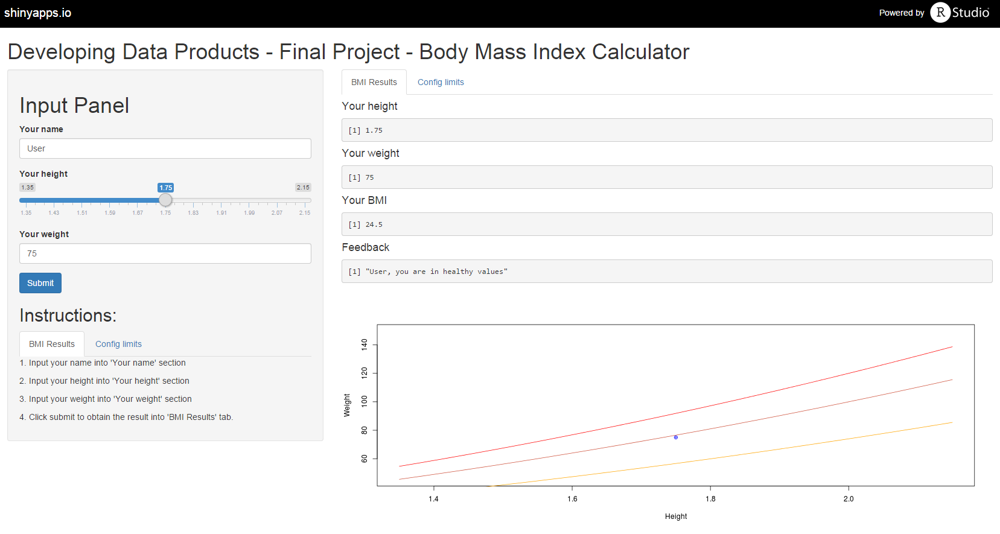

## Intro to BMI App

* This application allows the user to calculate Body Mass Index.

* Link to application: [BMI App](https://jmvilaverde.shinyapps.io/DSS_Developing_Data_Products_Final_Project_BMI_Calculator)

<div style='text-align: center;'>
    
</div>

--- .class &twocol #id &twocol

## Interface Results

*** =left
1.Input Panel:

* Your name: Name of the user.
* Your height: height of the user.
* Your weight: weight of the user.
* Submit button: executes calculation and refresh application.
* Instructions: Tab with instructions to use and configure app.

*** =right
2.Tab panel BMI Results

* Your height: height of the user.
* Your weight: weight of the user.
* Your BMI: Body Mass Index of the user.
* Feedback: Feedback about the BMI of the user.
* Plot: Plot Height vs.Weight that shows user BMI and limits.

--- .class #id 

## Interface Config

3.Tab panel Config

* Lower limit: value considered as lower limit for healthy BMI. As default 18.5
* Upper limit: value considered as upper limit for healthy BMI. As default 25
* Obesisty limit: value considered as limit for obesity BMI. As default 30

--- .class #id 

## BMI Formula

The formula used to calculate the BMI is: $BMI = \frac{weight}{height^2}$

Example:

```r
#Set weight
weight <- 84.3

#Set height
height <- 1.87

#Calculate BMI
BMI <- round(weight/(height^2),2)

#Print BMI result
print(BMI)
```

```
## [1] 24.11
```


